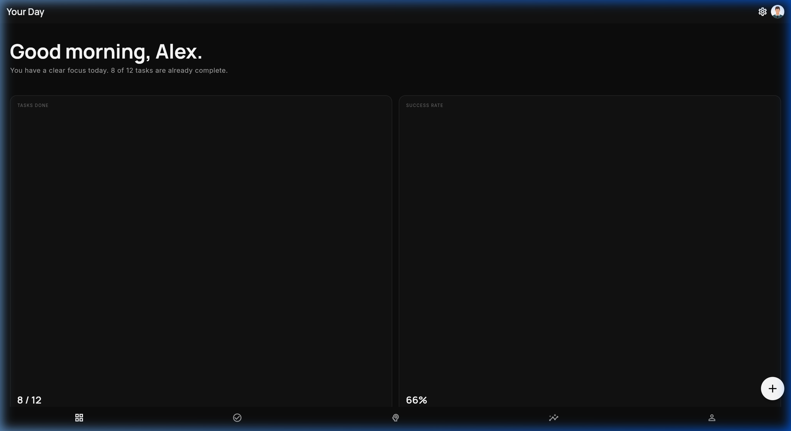
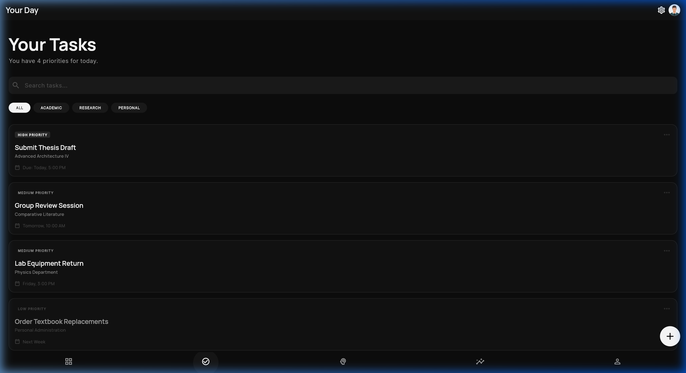
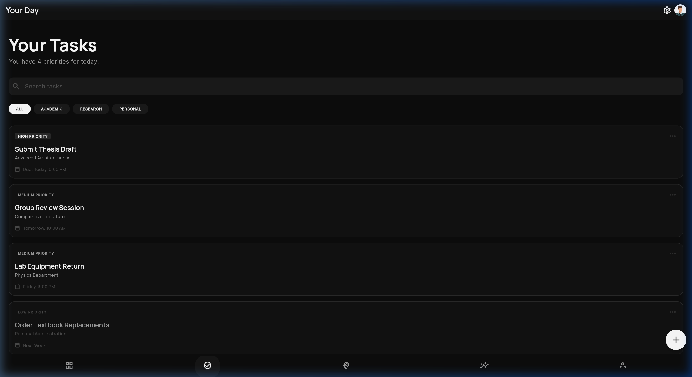

# Your Day - Flutter Application

A premium, high-performance personal productivity and growth application built with Flutter. "Your Day" features a sophisticated monochrome design system focused on minimizing distractions while maximizing academic and personal output.

## 🌟 Key Features

The application is structured into six core modules, all accessible through a unified navigation system:

1.  **Dashboard**: A sophisticated daily overview featuring a bento-grid layout for "Success Rate," "Tasks Done," and "Daily Streaks."
2.  **Tasks**: A priority-based task management system with search functionality and category filtering (Academic, Research, Personal).
3.  **AI Scheduler**: An intelligent time-blocking utility that optimizes study flows and focus windows based on academic intensity.
4.  **Personal Development**: A "Mastery Index" tracker to visualize growth in specific subjects and core competencies.
5.  **Analytics**: Weekly momentum and persistence tracking via dynamic charts and subject mastery indicators.
6.  **Settings**: Comprehensive account management, privacy controls, and system preferences.

## 🎨 Design Philosophy

-   **Monochrome Aesthetic**: A deep black (`#0D0D0D`) and pure white palette designed for high contrast and focus.
-   **Modern Typography**: Utilizes `Manrope` for headings and `Inter` for body text to provide a premium feel.
-   **Modular Components**: Built using a strict design system with reusable `CustomCard`, `StatTile`, and `CommonAppBar` components.

## 🛠️ Tech Stack

-   **Framework**: Flutter (Material 3 enabled)
-   **Language**: Dart (Null Safety)
-   **Typography**: Google Fonts (Manrope, Inter)
-   **Icons**: Material Symbols & Icons

## 📂 Project Structure

```text
your_day_app/
├── lib/
│   ├── main.dart             # Application entry point
│   ├── models/               # Data models
│   ├── screens/              # All 6 core application screens
│   ├── theme/                # Global AppTheme and AppColors configuration
│   ├── utils/                # Constants and helper utilities
│   └── widgets/              # Reusable UI components (CustomCard, StatTile, etc.)
```

## 🚀 Getting Started

### Prerequisites

-   Flutter SDK (Latest Stable)
-   Android Studio / VS Code with Flutter extensions
-   (Windows Only) Enable Developer Mode for plugin support

### Installation

1.  Clone the repository and navigate to the project directory:
    ```bash
    cd your_day_app
    ```

2.  Install dependencies:
    ```bash
    flutter pub get
    ```

### Running the App

-   **Web (Chrome)**:
    ```bash
    flutter run -d chrome
    ```
-   **Build APK**:
    ```bash
    flutter build apk --debug
    ```

## 📸 Screenshots





---
*Created with ❤️ for Your-Day productivity.*
